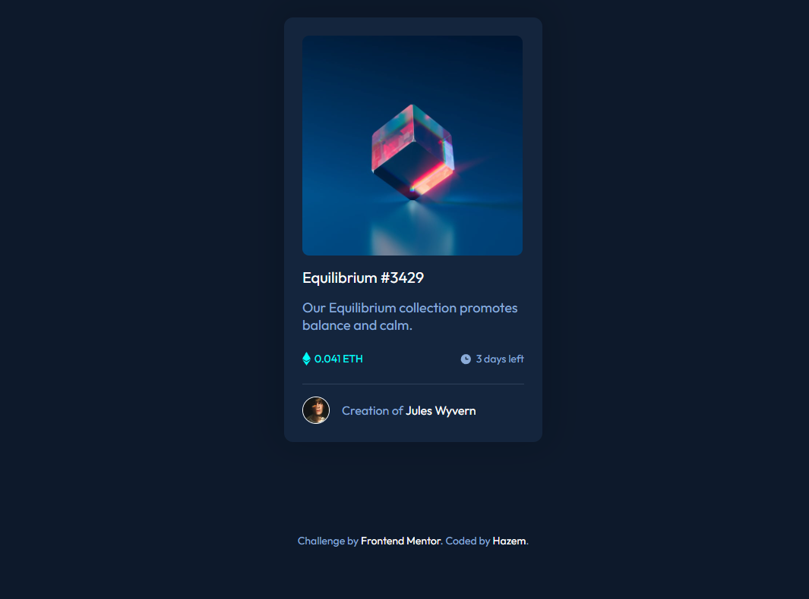

# Frontend Mentor - NFT preview card component solution

This is a solution to the [NFT preview card component challenge on Frontend Mentor](https://www.frontendmentor.io/challenges/nft-preview-card-component-SbdUL_w0U). Frontend Mentor challenges help you improve your coding skills by building realistic projects. 

## Table of contents

- [Overview](#overview)
  - [The challenge](#the-challenge)
  - [Screenshot](#screenshot)
  - [Links](#links)
- [My process](#my-process)
  - [Built with](#built-with)
  - [What I learned](#what-i-learned)
  - [Useful resources](#useful-resources)
- [Author](#author)


## Overview

### The challenge

Users should be able to:

- View the optimal layout depending on their device's screen size
- See hover states for interactive elements

### Screenshot




**Note: Delete this note and the paragraphs above when you add your screenshot. If you prefer not to add a screenshot, feel free to remove this entire section.**

### Links

- [Solution](https://your-solution-url.com)
- [Live Demo](https://hazemhussein14.github.io/NFT-Preview-card/)

## My process

### Built with

- Semantic HTML5 markup
- CSS custom properties
- Flexbox


### What I learned

I learned how to create an image overlay using CSS Pseaudo elements with nice and smooth effect while hovering

```html
<h1>Some HTML code I'm proud of</h1>
```
```css
header {
  width: 29rem;
  height: 29rem;
  background-image: url(images/image-equilibrium.jpg);
  background-size: cover;
  position: relative;
  cursor: pointer;
  border-radius: 9px;
  margin-bottom: 1.6rem;
}
header::before {
  content: "";
  position: absolute;
  top: 0;
  left: 0;
  width: 100%;
  height: 100%;
  background-color: var(--Cyan);
  opacity: 0;
  border-radius: 0.9rem;
  transition: var(--main-transition);
}
```

### Useful resources

- [Stackoverflow](https://stackoverflow.com/questions/21086385/how-to-make-in-css-an-overlay-over-an-image) - This helped me for creating the image overlay. I really liked this pattern and will use it going forward.
- [Imagekit.io](https://imagekit.io/blog/css-image-overlay/) - This is an amazing article which takes about overlaying images and text using different ways


## Author


- Frontend Mentor - [Hazem Hussein](https://www.frontendmentor.io/profile/HazemHussein14)


